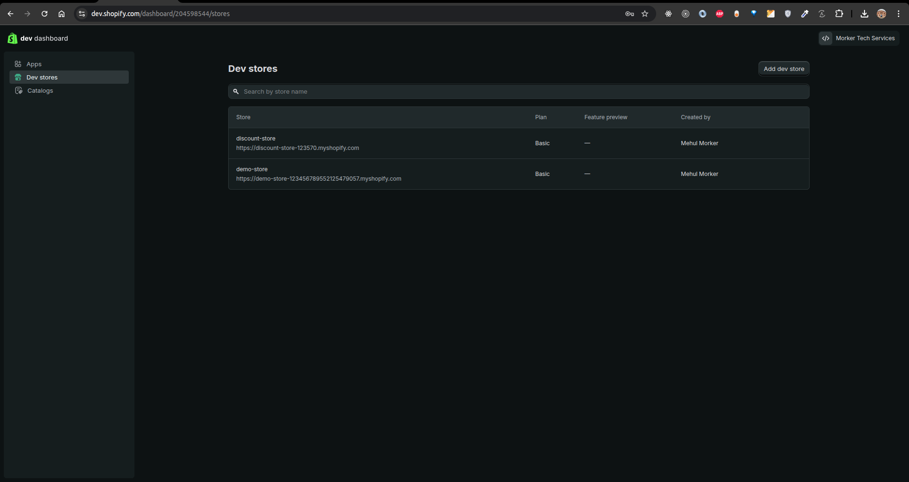
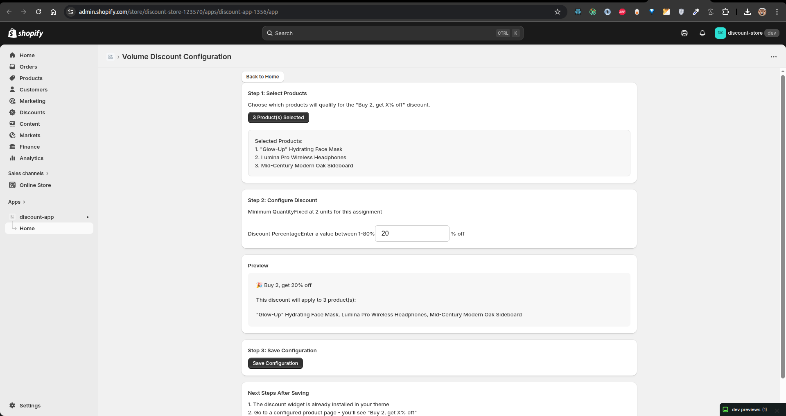
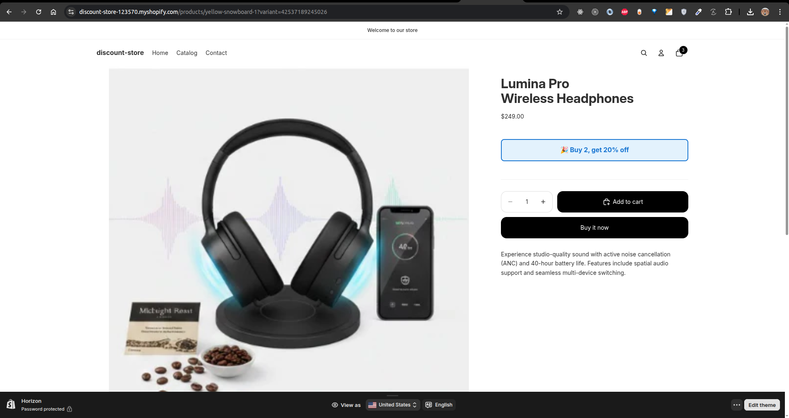
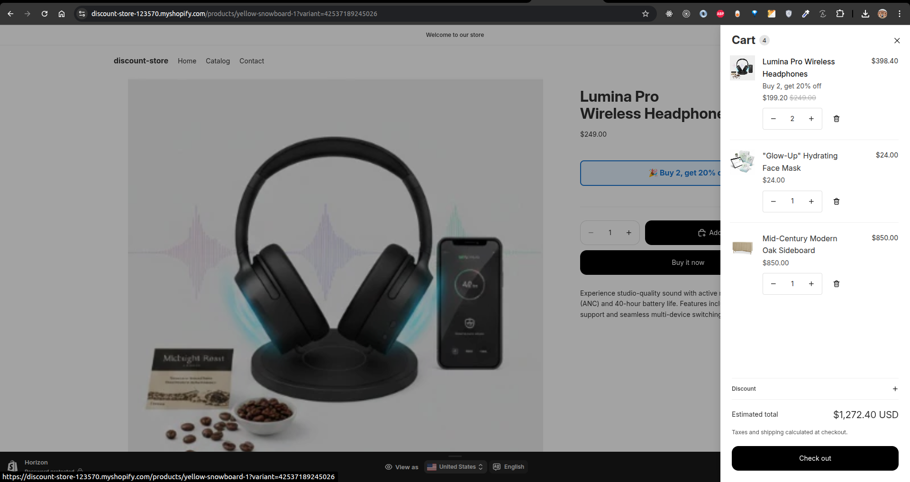

# Volume Discount Shopify App

A tiny Shopify app that creates a **"Buy 2, get X% off"** automatic discount using Shopify Functions, with an Admin UI to configure products and discount %, and a theme app extension widget on the Product page (PDP).

**Objective:** Build a Shopify app that lets merchants choose which product(s) and what % discount; stores config in metafields; applies discount via `cart.lines.discounts.generate.run`; and shows a widget on PDP (and optionally Cart).

---

## Tech Stack (MERN)

- **Backend:** Node.js
- **Database:** MongoDB (session storage via `@shopify/shopify-app-session-storage-mongodb`)
- **Frontend:** React, React Router 7, Shopify Polaris Web Components
- **Shopify:** Discount Function API (2026-01), Theme App Extensions, Admin GraphQL API, Metafields

*Note: An alternative branch uses Prisma + SQLite for session storage; this branch uses MongoDB.*

---

## Prerequisites

- **Node.js** `>=20.19 <22` or `>=22.12` (see `package.json` engines)
- **Shopify Partner account** — [Create one](https://partners.shopify.com/signup)
- **Development Store** — [Create a dev store](https://help.shopify.com/en/manual/partners/dashboard/development-stores/create) from the Partner Dashboard
- **Shopify CLI** — [Install Shopify CLI](https://shopify.dev/docs/apps/tools/cli/getting-started)
- **MongoDB** — Running locally or a connection string (e.g. `mongodb://localhost:27017/`)

---

## Install & Run

### 1. Clone and install

```bash
git clone <your-repo-url>
cd discount-app
npm install
```

### 2. Environment (MongoDB)

Ensure MongoDB is running. Optionally set:

```bash
export MONGODB_URI="mongodb://localhost:27017/"
export MONGODB_DATABASE="volume_discount_app"
```

Defaults in code: `MONGODB_URI` → `mongodb://localhost:27017/`, `MONGODB_DATABASE` → `volume_discount_app`.

### 3. Start development

```bash
shopify app dev
```

When prompted, select your **development store**. Press **P** to open the app URL; install the app when the browser opens.

### 4. Other useful commands

```bash
npm run build          # Build for production
npm run start          # Run production server (after build)
npm run deploy         # Deploy app and extensions to Shopify
npm run setup          # Prisma generate + migrate (if using SQLite branch)
```

---

## Where Config Is Stored (Metafields)

All discount configuration is stored in a **shop metafield** (no theme hard-coding).

| Field       | Value           |
|------------|-----------------|
| **Namespace** | `volume_discount` |
| **Key**       | `rules`          |
| **Owner**     | Shop             |
| **Type**      | `json`           |

**JSON shape:**

```json
{
  "products": ["gid://shopify/Product/123", "gid://shopify/Product/456"],
  "minQty": 2,
  "percentOff": 10
}
```

- **products:** Array of product GIDs to which the discount applies.
- **minQty:** Minimum quantity per line to qualify (fixed at `2` for this app).
- **percentOff:** Discount percentage (1–80). Set in Admin UI.

The **Discount Function** reads this metafield at runtime. The **Theme App Extension** reads it via `shop.metafields.volume_discount.rules.value` in Liquid.

---

## How to Add the Theme Block (Theme Editor)

1. In Shopify Admin, go to **Online Store → Themes**.
2. Click **Customize** on your theme (Online Store 2.0–compatible).
3. Open a **Product page** template (or a template that includes the main product section).
4. In the left sidebar, click **Add block**.
5. Under **Apps**, find **Volume Discount Badge** (from the `volume-discount-widget` theme app extension).
6. Add the block and place it where you want (e.g. in the Product information section).
7. Optionally adjust block settings (icon, colors, padding, etc.) in the theme editor.
8. Click **Save**.

The block shows **"Buy 2, get {percentOff}% off"** only when the current product is in the configured `volume_discount.rules` products list; otherwise it renders nothing.

---

## Project Structure (cross-verified)

```
discount-app/
├── app/
│   ├── routes/
│   │   ├── _index/                    # Landing / login
│   │   ├── app.jsx                     # App layout, nav, AppProvider
│   │   ├── app._index.jsx              # Admin config UI (products + %)
│   │   ├── app.additional.jsx          # Extra sample page
│   │   ├── auth.$.jsx                  # Auth callback
│   │   ├── auth.login/                 # Login route
│   │   └── webhooks.app.*.jsx          # App webhooks (e.g. uninstalled)
│   ├── shopify.server.js               # Shopify app + session (MongoDB)
│   ├── db.server.js                    # DB client (e.g. Prisma if used)
│   ├── entry.server.jsx
│   └── root.jsx
├── extensions/
│   ├── discount-function/              # Discount Function extension
│   │   ├── src/
│   │   │   ├── index.js
│   │   │   ├── cart_lines_discounts_generate_run.js    # Buy 2, X% off logic
│   │   │   ├── cart_lines_discounts_generate_run.graphql
│   │   │   ├── cart_delivery_options_discounts_generate_run.js
│   │   │   └── cart_delivery_options_discounts_generate_run.graphql
│   │   ├── shopify.extension.toml      # target: cart.lines.discounts.generate.run
│   │   └── tests/
│   └── volume-discount-widget/          # Theme App Extension
│       ├── blocks/
│       │   └── product-discount-message.liquid   # PDP widget "Buy 2, get X% off"
│       └── shopify.extension.toml
├── prisma/                             # Used in SQLite branch
├── shopify.app.toml
├── package.json
└── README.md
```

---

## Milestones (from requirements)

- **Milestone A – Dev env ready:** Partner account, dev store, app skeleton (one main config page). Use `shopify app dev` and install on dev store.
- **Milestone B – Discount works:** Function applies "Buy 2, get X% off" when cart has ≥2 units of a configured product (target: `cart.lines.discounts.generate.run`). Provide a screen recording showing cart behaviour.
- **Milestone C – UI + widget:** Admin UI saves config to metafield; PDP widget shows the correct message. Screen recording showing config save and widget on PDP.

---

## Acceptance Criteria (review checklist)

- [ ] App installs on a dev store without OAuth errors.
- [ ] Admin can select ≥1 product and set `percentOff`; Save persists to shop metafield `volume_discount.rules`.
- [ ] On PDP of a configured product, the widget shows "Buy 2, get X% off"; on non-configured products it shows nothing.
- [ ] In cart/checkout, adding 2+ units of a configured product applies X% discount to those lines; removing items or dropping below 2 units removes the discount.
- [ ] No discount when the product is not in the configured list.
- [ ] Clear README with setup/run steps, metafield namespace/key, and theme block instructions.
- [ ] Screen recording (with voice, ≤5 min) covering: app setup, architecture, admin config → save, PDP widget, cart with 2 units (discount) vs 1 unit (no discount).
- [ ] **Partner + Dev store screenshots included** (see Screenshots section below).

---

## Screenshots

*Attach the following screenshots (required for review). Save images in a `screenshots/` folder in the repo and link them below, or embed them in the README.*

### 1. Partner Dashboard – Stores page

*Required for Milestone A.*  
Screenshot of the Partner Dashboard **Stores** page showing your development store(s).


---

### 2. Dev store Admin

*Required for Milestone A.*  
Screenshot of your development store’s **Admin** (e.g. dashboard or Store settings) to confirm the dev store is set up.



---

### 3. App installed – Admin config page (optional)

*Optional; useful for Milestone C / demo.*  
Screenshot of the app open in Shopify Admin showing the Volume Discount Configuration page (product picker, discount %, Save).



---

### 4. PDP widget (optional)

*Optional; useful for Milestone C / demo.*  
Screenshot of a **product page** where the theme block shows “Buy 2, get X% off” for a configured product.



---

### 5. Cart with discount applied (optional)

*Optional; useful for Milestone B / demo.*  
Screenshot of the **cart** (or checkout order summary) with 2+ units of a configured product, showing the X% discount applied on the line.



## How It Works

1. **Admin UI (`app._index.jsx`):** Merchant selects products (resource picker) and discount % (1–80), then Save. The app writes JSON to the shop metafield `volume_discount.rules`.
2. **Discount Function:** Runs on `cart.lines.discounts.generate.run`. Reads `shop.metafield(namespace: "volume_discount", key: "rules")`, parses JSON, and for each cart line whose product is in `config.products` and quantity ≥ `minQty`, returns a percentage discount operation. Automatic discount; no code entry.
3. **Theme widget:** Liquid block reads `shop.metafields.volume_discount.rules.value`. If the current product is in the list, it shows "Buy {minQty}, get {percentOff}% off"; otherwise it renders nothing.


## Deliverables (from requirements)

- **Screen recording** (≤5 min, with voice; camera on preferred): app setup, architecture, admin config → save, PDP widget, cart with 2 units (discount) vs 1 unit (no discount).
- **One test product** pre-configured in the app for demo.
- **README** (this file): install & dev commands, where config is stored (metafield namespace/key), how to add the theme block, limitations/next steps.

---

## Troubleshooting

- **Widget not showing:** Ensure the block is added in Theme Editor (Apps → Volume Discount Badge) and the product is in the app’s configured product list. Check `shop.metafields.volume_discount.rules.value` in Liquid if needed.
- **Discount not applying:** Confirm quantity ≥ 2 and product is in `volume_discount.rules`. Check Discounts in Admin and function logs: `shopify app function logs`.
- **Product picker / session issues (MongoDB branch):** Ensure MongoDB is running and `MONGODB_URI` / `MONGODB_DATABASE` are correct. Check browser console and server logs for session/auth errors.
- **Build errors:** `rm -rf node_modules dist && npm install && shopify app dev`

---

## Official Docs (reference)

- [Become a Shopify Partner](https://partners.shopify.com/signup)
- [Create a Development Store](https://help.shopify.com/en/manual/partners/dashboard/development-stores/create)
- [Discount Function API](https://shopify.dev/docs/api/functions) (targets, input, operations) — use `cart.lines.discounts.generate.run`
- [Metafields](https://shopify.dev/docs/apps/custom-data/metafields)
- [Theme App Extensions & App Blocks](https://shopify.dev/docs/apps/online-store/theme-app-extensions)
- [Shopify App React Router](https://shopify.dev/docs/api/shopify-app-react-router)

---

## License

MIT
